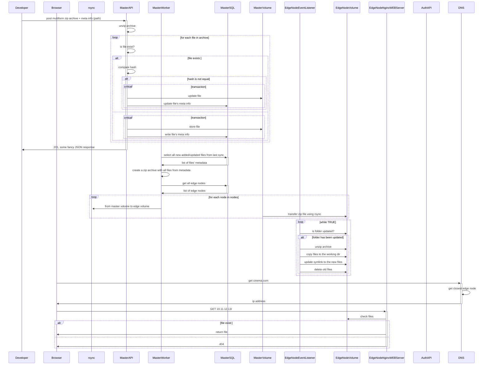

```mermaid
sequenceDiagram
    participant dev as Developer
    participant user as Browser
    participant rsync as rsync
    participant api as MasterAPI
    participant worker as MasterWorker
    participant sql as MasterSQL
    participant m_volume as MasterVolume

    participant el as EdgeNodeEventListener
    participant e_volume as EdgeNodeVolume
    participant edge_node as EdgeNodeNginxWEBServer
    
    participant auth as AuthAPI
    participant dns as DNS

    %% PART1: developer uploads static files
    dev ->>+ api: post multiform zip archive + meta info (path)
    api ->> api: unzip archive
    %% ideally to do it in one sql transaction
    loop for each file in archive
        api ->> api: is file exist?
        alt file exists:
            api ->> api: compare hash
            alt hash is not equal
                critical transaction
                api ->> m_volume: update file
                api ->> sql: update file's meta info
                end
            end
            %% *think about hash collision
        else
            critical transaction
            api ->> m_volume: store file
            api ->> sql: write file's meta info
            end
        end
    end
    api ->>- dev: 201, some fancy JSON response

    %% PART2: worker process the uploaded files and migrate it to the edge nodes
    worker ->>+ sql: select all new added/updated files from last sync
    sql ->>- worker: list of files' metadata
    worker ->> worker: create a zip archive with all files from metadata
    worker ->>+ sql: get all edge nodes
    sql ->>- worker: list of edge nodes

    %% can be paralleled
    loop for each node in nodes
        %% use backoff here
        worker ->>+ rsync: from master volume to edge volume
        m_volume ->> e_volume: transfer zip file using rsync
    end

    %% PART3: Edge node event listener updates its local files from tmp dir
    loop while TRUE
        el ->> e_volume: is folder updated?
        alt folder has been updated
            el ->> e_volume: unzip archive
            el ->> e_volume: copy files to the working dir
            el ->> e_volume: update symlink to the new files
            el ->> e_volume: delete old files
        end
    end


    %%PART4: User request static content
    user ->>+ dns: get cinema.com
    dns ->> dns: get closest edge node
    dns ->>- user: ip address

    user ->>+ edge_node: GET 10.11.12.13/
    edge_node ->> e_volume: check files
    alt file exist:
        edge_node ->> user: return file
    else
        edge_node ->>- user: 404
    end
```